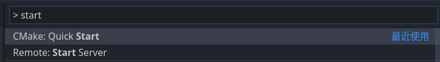

# VScode + CMake Workflow

## VS Code
[VS Code](https://github.com/Microsoft/vscode) 是一款强大的代码编辑器，结合 C++ 和 CMake 相关拓展，我们可以将 VS Code 配置成我们专属的 C++ IDE。

### 1 下载安装

打开 [VS Code 官网](https://code.visualstudio.com/)，下载

### 2 拓展安装
- C/C++
- C++ Intellisense
- C++ Clang Command Adapter
- CMake Tools
- CMake Tools Helper
- CMake

打开 VS Code

### 3 预备知识
按 <kbd>F1</kbd> 键调出控制台，这个将会是我们最常用到的快捷键，因为大多数 VS Code 拓展都提供很多实用的控制台命令。

### 4 实战
1. 初始化 CMake 项目
    <kbd>F1</kbd> 输入 `start` 回车
    
    
