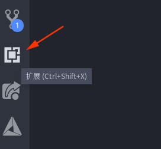

# VScode + CMake Workflow

## VS Code
[VS Code](https://github.com/Microsoft/vscode) 是一款强大的代码编辑器，结合 C++ 和 CMake 相关拓展，我们可以将 VS Code 配置成我们专属的 C++ IDE。

### 1 下载安装

打开 [VS Code 官网](https://code.visualstudio.com/)，下载安装完成安装。

### 2 拓展安装
- C/C++
- C++ Intellisense
- C++ Clang Command Adapter
- CMake Tools
- CMake Tools Helper
- CMake

打开 VS Code，点击左侧面板的拓展按钮，搜索上面列出的所有拓展并完成安装。

### 3 预备知识
在 VS Code 中，按下 <kbd>F1</kbd> 键会调出控制台，这个将会是我们最常用到的快捷键，因为大多数 VS Code 拓展都提供很多实用的控制台命令。

### 4 实战
#### 初始化 CMake 项目

1. 按下 <kbd>F1</kbd> 键盘打开控制台，输入 `start` 回车初始化 CMake 项目

    
2. 这时 CMake Tools 会让我们输入项目名称和项目类型:
    - 需要注意的是这里输入的 CMake 项目名中间不能出现空格，建议单词间的空格使用下划线代替，否则会出错。(实际上，CMake的项目名是支持有空格的，更详细的介绍请看 [project](../manuals/commands/project.md) 命令)
    - 由于我们一般创建的 CMake 项目最终都是为了生成可执行文件，所以项目类型一般选择 `Executable`。
    